# Account Validation & Reporting Engine
> **Production-Oriented Internal Automation Platform**
>
> 專為高頻 Trading / Rebate Account 批量作業 : 多監管牌照查詢與營運報表自動化打造的營運級資料管線（Operational Data Pipeline）。
>
> 系統整合多來源資料抓取、帳戶狀態驗證、規則比對與異常檢測流程，支援高頻查詢與批次處理場景。
>
> 透過非同步任務調度與標準化資料管線設計，將原本依賴人工查核的流程全面自動化，大幅降低操作時間成本並提升資料一致性與可追溯性。


### Metadata
- **Author:** Peter Chang
- **Type:** Internal Data Platform
- **Domain:** Trading / Rebate Account


# 🎯 Business Background (專案背景)

目前 CRM 平台在查詢時，存在大量人工操作流程：
- TradingAccount
- RebateAccount


即使只是確認帳號是否存在都必須經歷：
```text
1. 人工登入 CRM
2. 手動切換監管（Regulator）
3. 切換不同 Brand 環境
4. 搜尋 Account / UserId
5. 驗證資料是否存在
6. 確認帳號資訊
7. 人工整理結果
8. 手動輸出報表
```


# 🎯 Pain vs Value (營運痛點 vs 服務價值)

| 📌 指標分類（Category） | 🔴 傳統人工流程（Pain Points） | 🟢 自動化引擎（Solutions） | 📈 技術 / 商業價值（Impacts） |
|---|---|---|---|
| 時間成本（Time Cost） | ⏳ 單筆帳號查詢需 45~50 秒 | ⚡ Async 非同步高併發查詢 | 大幅降低人工等待與操作時間 |
| 執行效率（Execution Efficiency） | 🕒 755 筆案件需約 9.44 小時 | 🚀 約 1 分鐘內完成批次驗證 | 效率提升約 566 倍 |
| 監管切換（Regulator Switching） | 🔄 需人工切換多監管與品牌環境 | 🧠 Dynamic Payload Routing 自動路由 | 降低跨監管操作複雜度 |
| 人為風險（Human Error） | ❌ 容易漏查、切錯監管、資料誤判 | 🛡️ Validation Layer + Mapping Standardization | 降低 Human Error 與營運風險 |
| 報表產出（Reporting） | 📄 Report 需人工整理與彙總 | 📊 自動生成標準化 Output Report | 建立一致性的營運報表格式 |
| 稽核能力（Auditability） | 🔍 缺乏 Execution Trace 與 Audit Record | 🧾 Structured Logging + Audit Pipeline | 建立可追蹤、可稽核能力 |
| 可擴展性（Scalability） | 🧱 人工流程無法規模化 | 📈 支援數萬筆批次查詢 | 建立可擴展（Scalable）架構 |
| 人力依賴（Manpower Dependency） | 🧑‍💻 高度依賴人工營運操作 | 🤖 Fully Automated Operational Pipeline | 釋放營運人力資源 |
| 流程複用性（Reusability） | 📉 查詢流程高度重複且不可重用 | ♻️ Modularized ETL Workflow | 建立可複用的 Pipeline 架構 |
| 維運能力（Maintainability） | ⚠️ 發生錯誤時難以定位問題 | 🛠️ Centralized Exception Handling | 提升維運與 Debug 效率 |
| 資料一致性（Data Consistency） | 📂 歷史資料容易污染當日結果 | 🗓️ Daily Freshness Validation | 確保每日資料隔離與一致性 |
| 動態解析（Dynamic Resolution） | 🔌 不同帳號類型需不同人工處理方式 | 🔀 Dynamic Account Resolution | 自動判別 Trading / Rebate / UserId |
| 數據資產化（Data Assetization） | 📊 缺乏營運數據沉澱 | 🧮 Structured Reporting Asset | 建立可分析的營運資料資產 |
| 作業標準化（Standardization） | 🧭 缺少統一流程與作業標準 | 📐 Standardized Operational Flow | 降低 SOP 不一致問題 |
| 基礎設施能力（Infrastructure Capability） | 🏢 營運能力受限於人力規模 | 🏗️ Production-Oriented Automation Infrastructure | 建立可長期擴張的營運基礎設施 |


# 🎯 Service Architecture (微服務架構)

```text
Lark Input Sheet
        │
        ▼
Input Validation Layer
        │
        ▼
Dynamic Payload Generator
        │
        ▼
Async Multi-Regulator Crawler Engine
        │
        ▼
Data Cleaning & Transformation
        │
        ▼
Lark Output Sheet + Audit Record Sheet
        │
        ▼
Execution Logging & Daily Reset
```


# 🎯 Project Structure (專案目錄結構)

```text
project/
├── main.py            # 服務進入點（Entry Point）
├── pipeline.py        # 核心 Account ETL Pipeline
├── larkapi.py         # Lark API 封裝與錯誤攔截
├── logger.py          # Structured Logging System
├── mapping.py         # 靜態 Mapping 字典
├── payload.py         # Dynamic Payload Generator
├── general.py         # Async Job Runner
├── record.py          # Audit Record Transformer
├── crontab.txt        # 時間排程器(default: 10mins)
├── Dockerfile         # 跨環境protocol
└── docker-compose.yml # 執行必要protocol所需參數

```


# 🎯 Workflow (核心流程)

核心模組 `pipeline.py` ，採用標準 ETL Pipeline 設計：

```text
Extract → Validate → Transform → Load
```

將：

```text
原始營運請求
```

轉換為：

```text
可稽核營運資產
```


## 1️⃣ Step 0 — Data Freshness Validation

先檢查：

```text
Output Sheet 是否存在歷史資料
```

若資料日期早於今日：

- **自動清空舊資料**
- **重建空白列**
- **重置執行環境**

核心邏輯：

```python
mode_time = df2["comparisionTime"].mode().iloc[0]
```


### 💡 技術亮點

利用：

- `pandas.mode()`
- Daily Reset Strategy

建立 : **每日資料隔離（Daily Isolation)** 以避免跨日資料污染。


## 2️⃣ Step 1 — Input Validation Layer

自動驗證：

- Requestor 是否存在
- 是否提供查詢資料
- Input Structure 是否合法

若驗證失敗：

- 自動中止 Pipeline
- 將錯誤訊息回寫至 Record Sheet
- 保留 Validation Audit


### 💡 技術亮點

Validation Fail 不會：

```text
Silent Fail
```

而是：

```text
主動寫入 Audit Record
```

確保營運端可追蹤所有失敗原因。


## 3️⃣ Step 2 — Dynamic Resolution Engine

解析：

| 偵測項目 | 功能 |
|---|---|
| TradingAccount | Trading Query |
| RebateAccount | Rebate Query |
| UserId | User-Based Query |

並動態生成：

```python
jobs = payload_type(
    Ids,
    report_type=url_map[Account],
    column_type=column
)
```


### 💡 技術亮點

服務具備：
```text
Dynamic Payload Routing
```

可根據：

- Account Type
- Regulator
- Query Dimension

自動切換 API Routing。


## 4️⃣ Step 3 — Async Concurrent Execution

核心採用：

- `asyncio`
- `aiohttp`

建立高併發非同步查詢架構。


### Async Execution Example

```python
asyncio.run(
    run_admin_jobs(
        BRANDS=["VFSC", "VFSC2"],
        jobs=jobs,
        logger=logger
    )
)
```


### 💡 技術亮點

成功將：

```text
700+ Accounts
≈ 9 Hours Manual Work
```

壓縮至：

```text
≈ 1 Minute
```


## 5️⃣ Step 4 — Data Cleaning & Transformation

### Transformation Includes

- Country Mapping
- Regulator Injection
- Readonly Status Mapping
- Timestamp Injection
- Empty Job Tracking
- Requestor Binding


### Example

```python
countryCode = lambda x: x["countryCode"].astype(str).map(country_map)
```


### 💡 技術亮點

透過：

- Vectorized Transformation
- Lambda-Based Extraction
- Dictionary Mapping

建立：

```text
標準化營運資料矩陣
```


## 6️⃣ Step 5 — Upload & Cleanup

### Last Stage

- Upload Output Sheet
- Upload Record Sheet
- Reset Input Sheet
- Close LarkBot API Connection


### Output Includes

#### Output Sheet

- Requestor
- UserId
- Account
- ...


#### Record Sheet

- Requestor
- Execution Time
- Validation Result
- Return Message
- Execution Metadata


# 🎯 Structured Logging Strategy (過程策略)

服務採用：

```text
Structured Logging
```


## Logging Fields

| 欄位 | 說明 |
|---|---|
| stage | Pipeline 當前階段 |
| uid | Execution UUID |
| message | Execution Message |


## Example

```python
logger.extra["stage"] = "crawler_execution"
logger.extra["uid"] = uid
```


# 🎯 Error Handling (錯誤處理)

服務採用：

```text
Centralized Exception Handling
```


## Example

```python
try:
    run_account_pipeline(...)

except Exception as e:
    logger.error(str(e))
    logger.error(traceback.format_exc())
```


## Supported Error Scenarios

- Missing Requestor
- Invalid Account Column
- Empty Jobs
- Lark API Failure
- Data Transformation Error


# 🎯 Future Scalability（未來擴展方向）

目前服務已具備：
- Async Architecture
- Batch Processing
- Validation Layer
- Structured Logging
- Reporting Pipeline

未來可直接擴充：
- Kafka Event-Driven Pipeline
- FastAPI Service 化
- Redis Queue
- Distributed Worker
- Superset Dashboard
- Monitoring Metrics
- Queue-Based Execution


# 🎯 End2End Workflow 

```mermaid
flowchart LR
%% ========== Nodes ==========
A(("Start run_account_pipeline"))
B["Query output sheet"]
C{"Output rows > 1?"}
D["Convert output rows to DataFrame and parse comparisionTime"]
E{"Output data outdated?"}
F["Delete existing output rows and add empty row"]
G["Continue output validation"]
H["Query input sheet"]
I["Validate Requestor and query data existence"]
J{"Requestor present?"}
K{"Query data present?"}
L["Raise input validation error / exit"]
M["Detect valid crawler input column and IDs"]
N{"Valid column found?"}
O["Resolve account_type and column_type"]
P["Generate payload and run_admin_jobs async"]
Q["Clean and transform crawler results"]
R["Upload processed data and execution record"]
S["Reset input sheet"]
T(("Close client and finish"))

%% ========== Flow ==========
A --> B --> C
C -->|Yes| D --> E
C -->|No| G
E -->|Yes| F --> G
E -->|No| G

G --> H --> I --> J
J -->|No| L --> T
J -->|Yes| K

K -->|No| L
K -->|Yes| M --> N

N -->|No| L
N -->|Yes| O --> P --> Q --> R --> S --> T

%% ========== Rainbow Styling ==========
classDef red fill:#ffdddd,stroke:#ff4d4d,color:#000;
classDef orange fill:#ffe0b3,stroke:#ff9900,color:#000;
classDef yellow fill:#fff6b3,stroke:#ffd11a,color:#000;
classDef green fill:#d6f5d6,stroke:#33cc33,color:#000;
classDef blue fill:#d6e4ff,stroke:#3366ff,color:#000;
classDef purple fill:#ead6ff,stroke:#9933ff,color:#000;

%% Start
class A red;

%% Output validation stage
class B,C,D,E,F,G orange;

%% Input validation stage
class H,I,J,K yellow;

%% Decision / routing
class L,N red;

%% Processing pipeline
class M,O,P,Q green;

%% Finalization
class R,S,T blue;
```




